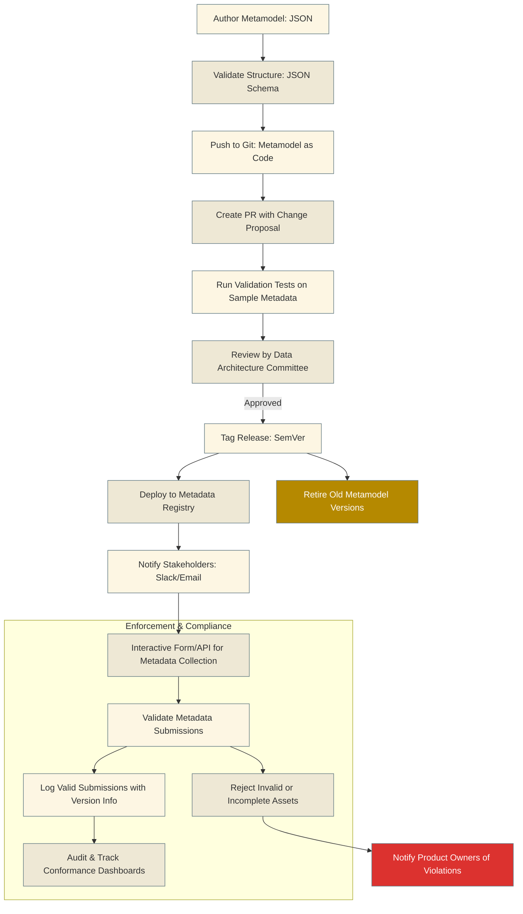

# metamodel
Enterprise Data Product Metamodel manamagement and the Data Product Life Cycle

## Executive Summary

This project defines a comprehensive Enterprise Data Product metamodel strategy and illustrates how it interacts with the Enterprise Data Product Life Cycle. The metamodel provides a structured framework for conceptualizing, designing, implementing, and managing data products within an enterprise context, ensuring alignment with business objectives, governance requirements, and user needs throughout the product lifecycle.


## Project Structure

```
metamodel/
├── .github/
│   └── workflows/
│       └── ci.yml
├── generated/
│   └── .gitkeep
├── metamodel_core/
│   ├── __init__.py
│   ├── data/
│   │   └── metamodel.json      # <-- The core metamodel JSON file
│   ├── models/
│   │   ├── __init__.py
│   │   ├── metamodel.py
│   │   └── validators.py
│   ├── schema/
│   │   ├── __init__.py
│   │   └── protobuf_generator.py
├── scripts/
│   ├── generate_schema.py
│   └── validate_metamodel.py
├── tests/
│   ├── __init__.py
│   ├── conftest.py
│   ├── test_models.py
│   ├── test_schema_generator.py
│   ├── test_validation.py
│   └── test_versioning.py
├── .gitignore
├── AUTHORIZED_INTEGRATORS.md
├── LICENSE
├── pyproject.toml
└── README.md
```

Here's a **vendor-agnostic, technical process** for managing the **end-to-end lifecycle of an enterprise metamodel**, including building, versioning, auditing, approving changes, and enforcing collection of metadata in alignment with the metamodel. This aligns with data engineering best practices and ensures enterprise governance.

---

## ⚙️ PART 1: Metamodel Lifecycle Management

### 1. **Design and Build**
| Step | Description |
|------|-------------|
| **Authoring Format** | Use JSON to define the metamodel structure (e.g., entity types, attributes, constraints, validation rules). |
| **Modular Design** | Decompose metamodel into reusable modules (e.g., `core_entity_types`, `common_attributes`, `lineage`, `governance`). |
| **Schema Validation** | Define JSON Schema to validate metamodel definitions for structure and allowed values. |
| **CI/CD Integration** | Treat metamodel as code in Git. Validate metamodel structure and integrity with pre-commit hooks or GitHub Actions. |

### 2. **Versioning**
| Step | Description |
|------|-------------|
| **SemVer Versioning** | Use Semantic Versioning (MAJOR.MINOR.PATCH) to track metamodel changes. |
| **Immutable Releases** | Store versions as immutable artifacts (e.g., Git tag, S3 object with versionId, or package in artifact registry). |
| **Change Logs** | Auto-generate changelogs highlighting added/removed/modified fields using tools like [`json-diff`](https://github.com/andreyvit/json-diff). |

### 3. **Change Proposals and Review**
| Step | Description |
|------|-------------|
| **Change Proposal Process** | Use GitHub Pull Requests with a templated form describing: <ul><li>Motivation</li><li>Impact to consumers</li><li>Backward compatibility</li><li>Validation strategy</li></ul> |
| **Technical Review Board** | Approvals by a data architecture committee with representation from governance, engineering, and product. |
| **Validation Suite** | Simulate impact on real metadata by running validation pipelines against a test corpus of data products. |

### 4. **Approval and Deployment**
| Step | Description |
|------|-------------|
| **Approval Artifacts** | Signed-off JSON/YAML record of approval metadata (who, when, justification). |
| **Controlled Rollout** | Support environment-specific deployment (dev/staging/prod) via IaC or metadata management APIs. |
| **Retirement Policies** | Mark old metamodel versions as deprecated with enforcement timelines and migration guides. |

---


## 📏 PART 2: Enforcement and Data Collection Aligned with the Metamodel

### 1. **Registration and Enforcement Framework**
| Step | Description |
|------|-------------|
| **Metadata Registry** | Implement a registry (e.g., via open-source catalog like Amundsen, DataHub, or internal API) that maps data products to required metadata fields per metamodel version. |
| **Metadata Contracts** | Define machine-readable metadata contracts per data product type (dataset, API, model) derived from metamodel. |
| **Enforcement Hooks** | Enforce contract adherence at: <ul><li>CI/CD pipeline (dbt tests, ingestion jobs)</li><li>Data registration time (e.g., Airbyte/Fivetran sync)</li><li>Publishing time (e.g., Lake Formation registration or catalog sync)</li></ul> |

### 2. **Metadata Submission Workflows**
| Step | Description |
|------|-------------|
| **Interactive Forms / APIs** | Provide validated UIs (e.g., Streamlit) or APIs for metadata input when required fields change. |
| **Slack/Email Notification** | Alert affected data product owners when new required attributes are added. |
| **Staging and Validation** | Validate metadata submissions in a staging environment. Use JSON Schema validation and business rule engines (e.g., JQ, Great Expectations). |

### 3. **Audit and Monitoring**
| Step | Description |
|------|-------------|
| **Change Logs & Diffs** | Maintain metadata change history for each asset with links to the applied metamodel version. |
| **Dashboards** | Track conformance KPIs: percentage of data products meeting latest metamodel, open violations, upcoming deadlines. |
| **Policy Alerts** | Raise flags for missing metadata or late adoption of required fields via alerting systems (e.g., Data Observability tool or homegrown script). |

---

## 🧩 Tooling Considerations (Vendor-Agnostic)
| Category | Options |
|---------|---------|
| **Version Control** | GitHub / GitLab / Bitbucket |
| **Validation** | JSON Schema, Great Expectations, JQ |
| **Packaging** | JSON/YAML + CI pipeline (e.g., GitHub Actions) |
| **Registry** | PostgreSQL/Neo4j or Open Metadata/Amundsen/DataHub |
| **CI/CD for Metadata** | dbt tests, Airflow tasks, GitHub Actions |
| **Notification** | Slack, PagerDuty, Email via webhooks |
| **Audit Storage** | S3, Lakehouse table with Iceberg/Delta, ElasticSearch |

---

## ✅ Example: New Attribute Enforcement Workflow

> **Scenario:** A new required attribute `data_sensitivity_level` is added to the metamodel for all datasets.

1. A PR is submitted to add `data_sensitivity_level` to the `core_attributes` module.
2. CI runs validation: all test metadata records are scanned.
3. PR is approved by the Data Architecture Committee and tagged as v2.1.0.
4. Deployment pipeline marks v2.1.0 as "default" for dev environment.
5. Slackbot notifies all data product owners with affected assets.
6. UI/API is made available to submit `data_sensitivity_level`.
7. Metadata registry enforces collection and rejects incomplete registrations.
8. Audit logs track all metadata updates and show coverage over time.

---

## PART 3: Visualization of Metamodel Lifecycle Management & Enforcement and Data Collection Aligned with the Metamodel
