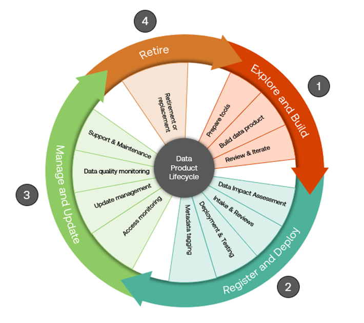
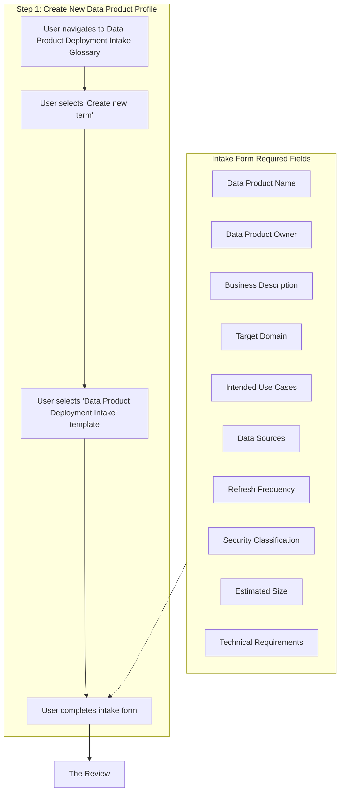
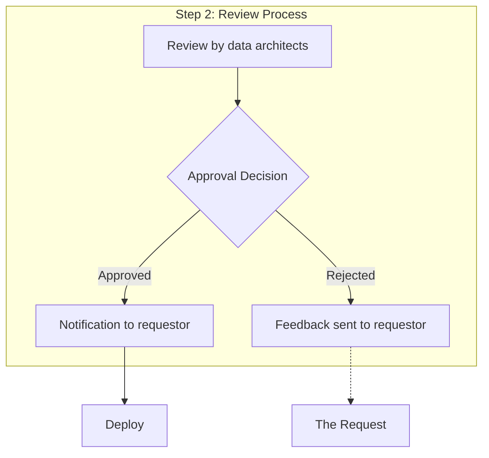
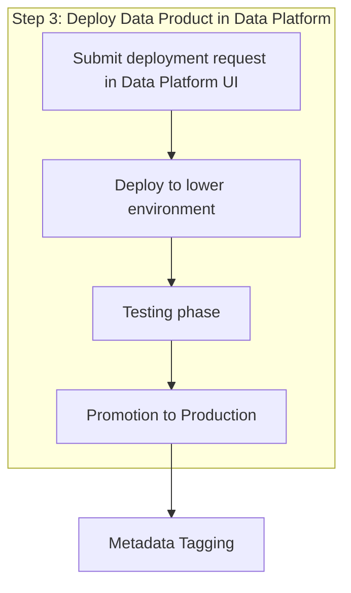
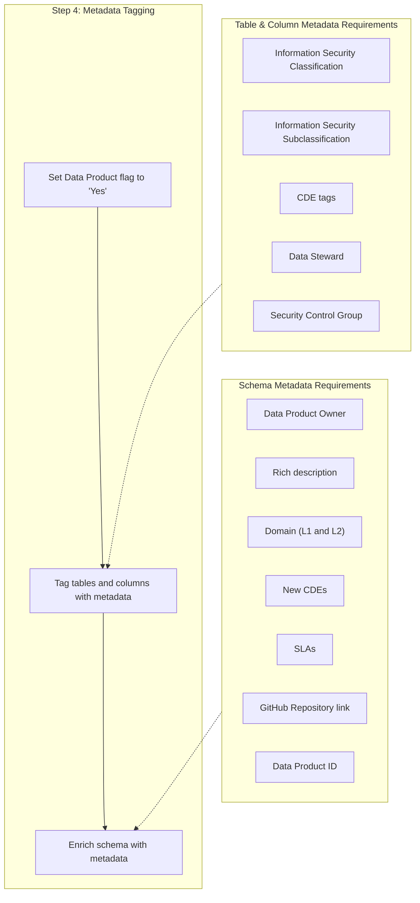

# Data Product Lifecycle v.1

May 2025

| **Date**       | 2025.05.01                                                                   |
|----------------|------------------------------------------------------------------------------|
| **Contributors** | Pouya Barrach-Yousefi                                                      |
| **Version**    | 0.1 (beta) -- Working version drafted based on previous documentation.       |
| **Description**|                                                                              |

# Table of Contents

- [Introduction](#introduction)
  - [Motivation for Enterprise Data Products](#motivation-for-enterprise-data-products)
  - [Document Purpose and Scope](#document-purpose-and-scope)
- [Data Product Overview](#data-product-overview)
  - [Data Product Definition](#data-product-definition)
  - [Data Product Characteristics](#data-product-characteristics)
  - [Benefits of Data Products](#benefits-of-data-products)
  - [Key Roles](#key-roles)
- [Data Product Lifecycle](#data-product-lifecycle)
  - [Data Product Build](#data-product-build)
    - [Data Build Tool (dbt)](#data-build-tool-dbt)
    - [Engaging Architecture Support](#engaging-architecture-support)
  - [Data Product Deployment](#data-product-deployment)
    - [Prerequisites](#prerequisites)
    - [Step 1: Submit Data Impact Assessment](#step-1-submit-data-impact-assessment)
    - [Step 2: Create new Data Product Profile](#step-2-create-new-data-product-profile)
    - [Step 3: Deploy Data Product in Data Platform](#step-3-deploy-data-product-in-data-platform)
    - [Step 4: Metadata Tagging](#step-4-metadata-tagging)
  - [Data Product Management](#data-product-management)
    - [Catalog Management](#catalog-management)
    - [Access Management](#access-management)
    - [Enhancements and Change Management](#enhancements-and-change-management)
    - [Quality Monitoring](#quality-monitoring)
    - [Operational Support](#operational-support)
  - [Data Product Retirement](#data-product-retirement)
    - [When to consider](#when-to-consider)
- [Data Product Governance](#data-product-governance)
  - [Overview of data governance and ethics principles](#overview-of-data-governance-and-ethics-principles)
  - [Data privacy and security considerations](#data-privacy-and-security-considerations)
  - [Fairness, transparency, and accountability in data products](#fairness-transparency-and-accountability-in-data-products)
  - [Regulatory compliance and standards](#regulatory-compliance-and-standards)

# Introduction

Data products are a pivotal concept in modern data management, representing a shift from traditional data assets to a more structured and strategic approach. They are consumption-ready sets of quality, trustworthy, and accessible data that people across an organization can use to solve business challenges. This approach treats data as a product, emphasizing its value, usability, and re-usability.

## Motivation for Enterprise Data Products

Currently, lots of valuable data of interest enterprise-wide sits within enterprise business areas with limited governance and ability to share, and no transparency for users across the organization. The existing approach requires users to access data through the source layer, resulting in teams investing considerable time and effort in normalizing, transforming, and combining data to create more valuable datasets. Moreover, the inability to discover and share these datasets leads to duplicated efforts across teams. The initial implementation of a Data Product Strategy aims to address this challenge by tackling the following questions:

- How can we reduce the engineering time for analytics teams to build datasets?
- How do we best expose enriched datasets developed by analytics teams to the enterprise in an operationally efficient and governed manner?
- How can we minimize the opportunity cost of repetitive questions on shared, enriched datasets moving forward?

## Document Purpose and Scope

This document introduces the core components of our data product strategy. Its objective is to familiarize readers with the terminology and principles employed by data driven organizations to execute the Data Product Strategy, as well as serve as a guide to the activities that span the entire data product lifecycle. *The scope of this document is limited to the current concepts and processes in place at a mature data organization as part of the initial implementation of data products*, with the understanding that many of these elements are likely to evolve with enhancements in the future.

CURRENT SCOPE: The full data product service today supports products built off underlying data residing in the Enterprise Data Lake, with transformations built in dbt, that can be deployed as a single schema in the Data Platform. Other datasets may be classified as data products but are responsible for meeting data product criteria through their own mechanisms.

# Data Product Overview

## Data Product Definition

A **data product** is a ready-to-use set of accessible and enriched quality data that is built to deliver specific objectives and business value and can be consumed in a self-service manner.

A data product should be leveraged when you have created a valuable dataset by transforming and enriching a variety of data sources, which can then be reused by teams across the enterprise. Examples of a data product include:

- Curated, normalized, and restructured views of source data, making it more usable and immediately consumable
- Integrated datasets that consolidate data from multiple sources, providing a unified view
- Derived datasets resulting from aggregations, calculations, or analyses of multiple data sets, offering new insights and value

### Data Product Characteristics

1. **Discoverable and Interoperable:** Data Products should be easily discoverable and usable through intuitive user and machine interfaces.
2. **Accurate and Reliable:** They must undergo validation and cleaning with performance and quality monitoring in place (beginning at the source), as well as operational support and monitoring.[^1]
3. **Curated and Continuously Updated:** Data products should be maintained by owning teams, deploying enhancements as necessary to remain up-to-date and relevant based on business changes or consumer feedback.
4. **Trustworthy and Transparent:** Data products must have established lineage, accessible code, and rich documentation to ensure that a user has full transparency into their creation. Consumer feedback should be visible as further measurement through "Endorsements" in the data catalog.
5. **Built-for-purpose and Value-driven:** They must have a clearly defined purpose and measurable value addressing business needs. ROI and pricing of the data product [^2]
6. **Comprehensive:** Every and all possible metadata related to the data is contained with the data product including usage details.
7. **Unique:** Data products are designed to be non-redundant, avoiding duplication of other data products or datasets, and instead, providing a unique and valuable perspective or insight that complements existing data assets. This focus enables organizations to reduce unnecessary data sprawl. One data product == One schema

### Benefits of Data Products

1. **Conformed Source of Truth:** Data products provide standardized datasets that cater to multiple use cases, ***business rules applied to achieve an enterprise view,*** and are prepped for consumption by end-users, ensuring consistency of insights across the organization.
2. **Efficiency and Collaboration:** Standardized and reusable datasets are easily searchable, promoting knowledge sharing and collaboration among analysts.
3. **Speed to Market:** Analysts can focus on producing valuable insights rather than dealing with data inconsistencies, or re-engineering datasets for secondary uses, accelerating the time to market for data-driven decisions.
4. **Improved Governance and Security:** Datasets are shared through a governed, monitored, and supported route that ensures compliance to regulatory standards and licensing.
5. **Scalable Consumption:** Users can access data through a standard, governed, and efficient route which reduces the engineering efforts required, and minimizes security risks and operational costs as consumption scales.
6. **Simplified Architecture:** The data product strategy offers a standardized and streamlined approach to data consumption, eliminating the need for point-to-point integrations and complicated API calls and instead, providing a single, unified route for accessing data.

## Key Roles

| **Data Product Owner** | A Data Product Owner is responsible for overseeing the end-to-end lifecycle management of a data product at TR. They will generally be recognized as subject matter experts (SMEs) with knowledge of the transformations of the datasets contributing to a data product.  This role is responsible to: - Develop and communicate a clear vision and objective for the data product. - Collaborate closely with technical teams to ensure seamless integration and deployment of data products. - Ensure compliance with data governance policies, standards and controls while accessing data to develop a data product. - Ensure quality and accuracy of data products by defining acceptance criteria, conducting testing, and validating outputs against requirements. - Creation and maintenance of data product documentation in the data catalog, ensuring that it contains accurate, up-to-date, and relevant information to enhance discoverability. - Monitor the performance and usage of data products, gather feedback from data consumers, and iterate on features to optimize performance and user satisfaction. |
|------------------------|------------------------------------------------------------------------------------------------------------------------------------------------------------------------------------------------------------------------------------------------------------------------------------------------------------------------------------------------------------------------------------------------------------------------------------------------------------------------------------------------------------------------------------------------------------------------------------------------------------------------------------------------------------------------------------------------------------------------------------------------------------------------------------------------------------------------------------------------------------------------------------------------------------------------------------------------------------------------------------------------------------------------------------------------------|
| **Data Product Developer** | Data Product Developer(s) are responsible for developing data pipelines and managing data transformations. They work closely with data product owners to implement the technical aspects of data products.  Responsibilities: - Comply with standards and best practices for the data product build (architecture standards, code best practices, etc.). - Collaborate with platform teams to ensure seamless integration and deployment of data products in production environments. - Maintain the data products to ensure ongoing performance, security, and reliability. - Adhere to best practices in the execution of the data product. |
| **Data Consumer** | A Data Consumer uses data products to derive business insights and make informed decisions. They provide feedback on usability and quality.  Responsibilities: - Request access to the required data through formal channels, while adhering to security protocols. - Ensure compliance with data governance policies and standards while accessing and using data products. - Provide feedback to data product owners regarding usability, relevance, and quality of the data products, contributing to its refinement and useability. |
| **Enterprise Data Architect** | Data Architects provide guidance on data product design, ensuring compatibility and adherence to enterprise principles.  Responsibilities: - Engage teams in the process of building an anticipated data product to provide feedback during the design period. - Provide a data architecture review for all new data product deployment requests. - Participate in the review and approval of new data product deployment requests. |
| **Data Governance Team** | The team is responsible for establishing and maintaining data governance frameworks, policies, and standards and for engaging with Data Product teams at defined governance hooks during the data product lifecycle.  Responsibilities: - Ensure compliance with regulatory through the Data Impact Assessment, enterprise data & model governance policies, standards, and controls. - Oversight & maintenance of the Data Quality Issue Dashboard, including training and enablement to set clear expectations. |

# Data Product Lifecycle

We consider the lifecycle of a Data Product in 4 phases:

1. **Explore and Build:** The focus of this initial phase is on refining the purpose and design of the data product. The prospective data product teams should spend time identifying the business needs, opportunities, or pain points that the data product addresses and develop a clearly articulated value proposition. With the value identified, the team explores underlying data sources and transformations to design the desired final dataset.[^3]

2. **Register and Deploy:** In this phase, the data product is readied for release by undergoing necessary reviews and having its metadata documented. Upon approval, the data product is tested and deployed to consumers.

3. **Manage and Update:** This phase represents most of the data product's lifecycle, during which it is continuously maintained and updated to ensure it remains high quality, relevant, and valuable to its users.

4. **Retire:** This is the final phase in the data product lifecycle, where it is intentionally removed from service or replaced by a newer version. This phase is critical to ensure that outdated or non-compliant data products do not continue to consume resources and be accessed.

## Data Product Build

This section outlines the steps required to build a data product from start to finish. This involves setting up required tooling,

Activities:

- Set up tools
  - What is required? - DBT, GitHub
  - Data in data lake
- Design enriched dataset
  - Modeling the data in Erwin
    - How does this align to the enterprise domain model
  - What are the access considerations
- Engage Architecture

### Data Build Tool (dbt)

dbt™ (database tool) is a SQL-first transformation workflow that lets teams quickly and collaboratively deploy analytics code following software engineering best practices like modularity, portability, CI/CD, and documentation.

We leverage dbt projects to manage data in our Snowflake databases. These projects are maintained in GitHub repositories. The GitHub projects are then used by the platform team to manage and maintain our data and schema in production databases.

Recommended Structure/environments/code promotion process: OUTSTANDING, Data Product Build documentation in-progress

### Engaging Architecture Support

Role of architecture support/review

When/how to engage

- Who?
  - Data and Analytics Data Architecture Team
- Architecture team should be engaged early in the process to validate design
  - Is this aligned to EDM
  - Duplicate of other efforts
  - Validate underlying data model
  - Understand the purpose to the data product
  - Do we know the SLAs
- Benefit
  - Engaging early reduces risk of re-design, incorporates architecture perspective to strengthen approach

## Data Product Deployment

The deployment phase starts when the team identifies the intention to make their dataset available to the enterprise. The phase involves formally registering the dataset, tagging it for governance and discoverability, and deploying it to a production environment. By completing these activities, organizations can ensure their data products are properly prepared for enterprise-wide consumption, increasing adoption and value while minimizing risk.

### Prerequisites

1. Data Product Owner(s) are identified.
2. The business value of the intended data product is identified.
3. Data Product Owner has AWS access.
4. Data required for building the data product is in the Enterprise Data Lake.[^4]
5. The Data Product Owner has an MDS and has been granted access to the data required for building Data Products in that MDS.
6. Data Product Owner understands the tools required to support a Data Product.[^5]

### Step 1: Submit Data Impact Assessment

The Data Impact Assessment (DIA) is a comprehensive and enterprise-wide assessment necessary for legal compliance and risk assessment purposes. The assessment narrows down and flags risks which are then reviewed by a team in Data & Model Governance and sent off for mitigation.

A DIA can be submitted through the [self-service portal]() in ___________. For data product deployment, the requestor should select the "Data Product" use case and fill in all required fields. Once submitted, the requestor will receive the DIA ID required in upcoming deployment steps.

### Step 2: Create new Data Product Profile

**The Request:**

The purpose of the intake request process is to capture key information needed to establish the technical set-up required to enable a Data Product Owner to deploy the product to production, as well as to apply top-down governance and reviews to ensure consistency across data products.

[Deployment Request User Guide]()

A user submits the intake request in the Enterprise Data Catalog by navigating to the "Data Product Deployment Intake" Glossary or using the quick link on the catalog homepage, and selecting, "Create new term." The user will then be asked to select the term template, where they choose "Data Product Deployment Intake," before being presented with a form with all required fields for the intake.

After completing all fields, the user selects "Submit for review" and the review group is notified of the new request.

**The Review:**

The review group consists of a group of data architects well-versed in the data product strategy. The purpose is to ensure strategic architecture and alignment to the enterprise data product strategy. As part of the review, they complete the following:

- Data architecture review
- Assess for potential duplication of existing products
- Assess for a potential to replace raw source tables -- notify governance team if appropriate
- Ensure proper ownership
- Ensure proper naming of the data product

Upon approval, the requestor will be notified via email and can then move to the Data Platform request (step 3).

### Step 3: Deploy Data Product in Data Platform

THIS STEP IS OWNED BY THE DATA PLATFORM TEAM

[Data-Product-Deployment-Steps.docx]()

Description of process from submitting request in Data Platform UI

What can the Data Product Owner expect to see -- notification, timelines, permissions

Process to deploy in lower environment

Testing expectations

Promotion to Production

### Step 4: Metadata Tagging

Once the data product is promoted to Production, the schema and tables will become available in the Enterprise Data Catalog. The Data Product Owner is responsible for ensuring that the data product schema and tables are updated with rich documentation to ensure their discoverability and usability by consumers.

To start, the Data Product Owner must set the Data Product flag to "Yes."

- **Data product owner** must ensure all tables and columns related to their Data Product in the catalog are tagged with the following metadata:
  - Information Security Classification (Strictly Confidential, Confidential, Internal and Public) as documented in the Data Security Classification Standard.
  - Information Security Subclassification (has PII, has PCI, no PCI, no PII). Data Sensitivity tags need to be inherited from the data source if the tables have not been changed.
  - Inherit all CDE tags from the data source if the tables have not been changed.
  - Data Steward -- if different from the Data Product Owner
  - Security Control Group -- adhering to standard format: Domain.Data Product Name.Classification

- **Data product owner** must ensure the Data Product schema is enriched with the following metadata:
  - Data Product Owner
  - Rich description including creation, purpose, valid uses and intended audience. Be sure to include any terms or context useful for understanding the dataset.
  - Domain (L1 and L2) according to the published Enterprise Data Model Guideline.
  - Any new CDE's created/derived from data transformation activities which make up their data product in the live environment.
  - Established Service Level Agreements (SLAs)
  - Link to the GitHub Repository
  - Data Product ID

## Data Product Management

In this phase of the data product lifecycle, the focus shifts from development to ongoing maintenance and optimization. The management phase starts after the data product has been successfully deployed and encompasses all activities necessary to ensure the continued health, relevance, and value of a data product as it is being consumed across the enterprise.

### Catalog Management

Effective data product cataloging is a crucial tool for maximizing the value of a data product by enabling users to easily find, understand, and access the data product capabilities. Providing comprehensive documentation, including user guides and technical specifications, is equally important as it helps users to effectively utilize the data product and reduces the risk of misinterpretation or misuse.

Data products are cataloged in the Enterprise Data Catalog, which leverages the Alation SaaS solution. Throughout the life of a data product, data product owners are responsible to:

- Ensure all relevant metadata fields on the Data Product record are populated and up to date.
- Maintain detailed documentation on the data product to enable users to better understand and leverage the dataset. This documentation should be immediately accessible within or from the data catalog and should explain both technical and business context relevant to the product.

Also available in the catalog is **data lineage**. Lineage is an important aspect of data products as it provides a clear understanding of the origin, movement, and transformation of data through the development, enabling trust and transparency to consumers. Lineage is exposed in the Enterprise Data Catalog at the *table* and *column* levels under the "Lineage" tab. The information is automatically populated using Manta, a data lineage tool, and lineage harvested from dbt.

### Access Management

Once live in production and properly cataloged, a data product can be accessed by consumers across the enterprise. Access to data products is managed through policy-based access control supported by Immuta and Sailpoint. The *Security Control Group* field at the table-level controls the granularity of access.

Access to any tables or data products classified as *Internal,* is automatically granted to all users across the Enterprise with no approval required by the Data Product Owner. For any data classified at a higher level, access must be requested by the consumer via the Enterprise Data Access Request form -- [Person](). The Data Product Owner is responsible for evaluating and approving all access requests to the data product and monitoring that access over time, reviewing user access logs at minimum biannually and remove any users who have left the organization, changed roles, or no longer require access.

### Enhancements and Change Management

At many points during the data product lifetime, enhancements will be required to ensure the data product continues to meet evolving data, user needs, and business requirements. Through enhancements, data products can be updated with new features, functionality, and data sources, ensuring they remain relevant and valuable.

**Deploying a change to your data product**

Change to data source initiated in the data product deployment request form

**Updating data product metadata**

### Quality Monitoring

Data Quality Framework and Data Quality Standard

DQ Dashboard

### Operational Support

## Data Product Retirement

**Data Product owner** is responsible to decide on the end of life of the data product. This would include discontinued support, communicating retirement and migrating users to alternative sources.

In advance of retiring a Data Product, the Data Product owner must first perform a business impact assessment (quantify downstream impacts), notify all data product consumers of the assessment within a reasonable timetable, allowing them to plan accordingly and communicate any outcomes from the assessments.

### When to consider

- If a single or no data product Consumers are actively using the asset, then consider retirement.
- If the data product's purpose no longer aligns with the pre-defined uses, then it is a signal to retire the Data Product or develop a new Data product.
- If the existing Data Product deviates from the intended purpose, the current version will need to be replaced by a new version to meet the data consumers' needs.
- If the data product consistently fails DQ thresholds, then it must be turned off or retired from being searchable until the quality issue can be resolved.
- If one or more data sources is consistently down or contaminated for periods of time, then it can no longer be deemed reliable and should be turned off or retired after careful consideration.
- Regulatory pressures or litigations may require turning off one, several or All input data sources used in a data product. This is a leading indicator for retirement or replacement of the data product.
- A Data Subject Access Request (DSAR) may result in automatic retirement or replacement of a Data Product. The Data Product owners must cooperate with the DSAR request.

Data Product owners must consult with data governance teams to document policies relating to the retention period and steps to delete data following its useful life in a data product.

- Executive direction can be used to retire or replace a data product.

# **Data Product Governance**

### Overview of data governance and ethics principles

Data governance and ethics form the foundation of a robust data product strategy, ensuring that data products are not only valuable but also responsibly managed throughout their lifecycle. Our governance framework for data products is built on the following key principles:

1. **Data Ownership and Stewardship:** Clear accountability is established through defined roles such as Data Product Owners and Data Stewards, who are responsible for the quality, security, and appropriate use of data products.

2. **Metadata Management:** Comprehensive metadata is maintained to document the origin, purpose, lineage, quality, and usage restrictions of data products, enabling proper discoverability and understanding.

3. **Enterprise Alignment:** Data products must align with the Enterprise Data Model (EDM) and comply with organizational data strategies, taxonomies, and standards to ensure consistency and interoperability.

4. **Ethical Use:** Data products are developed and used in ways that respect ethical considerations including privacy, fairness, and potential societal impacts, guided by our corporate values and ethical frameworks.

5. **Value Realization:** Data products are designed to deliver measurable business value while balancing innovation with responsible management and use of enterprise data assets.

These principles are not static but evolve with changing business needs, technological advancements, and regulatory landscapes, requiring periodic reviews and updates to the governance framework.

### Data privacy and security considerations

Data products must adhere to stringent privacy and security standards to mitigate risks and protect sensitive information. Key considerations include:

1. **Classification and Handling:** All data products must be classified according to the Data Security Classification Standard (Strictly Confidential, Confidential, Internal, and Public) with appropriate subclassifications for PII and PCI data, determining how they are stored, processed, accessed, and shared.

2. **Privacy by Design:** Privacy considerations are incorporated from the inception of data product development, not as an afterthought. This includes conducting Data Impact Assessments (DIAs) to identify and address privacy risks before deployment.

3. **Access Controls:** Policy-based access control mechanisms (implemented through Immuta and Sailpoint) ensure that only authorized users can access data products, with more stringent approvals required for sensitive data classifications.

4. **Security Control Groups:** Standardized Security Control Group naming conventions (Domain.Data Product Name.Classification) are applied to facilitate consistent and appropriate access management.

5. **Data Minimization:** Data products should include only the data necessary to fulfill their intended purpose, minimizing privacy risks by limiting unnecessary data elements.

6. **Monitoring and Auditing:** Regular access reviews (minimum biannually) and audit logs ensure compliance with access policies and help detect unauthorized access attempts.

7. **Data Subject Rights:** Processes are in place to address Data Subject Access Requests (DSARs) that may impact data products, potentially requiring modifications or retirement of affected products.

Security and privacy considerations for data products are not one-time assessments but ongoing requirements that must be regularly reviewed and updated as regulations evolve and new threats emerge.

### Fairness, transparency, and accountability in data products

Creating and managing data products in an ethical manner requires commitment to fairness, transparency, and accountability throughout the data product lifecycle:

1. **Fairness in Data Products:**
   - Data products must be designed to avoid perpetuating or amplifying biases present in source data
   - Regular assessments are conducted to identify potential discriminatory impacts or unintended consequences
   - Diverse perspectives are incorporated during the design and review of data products to minimize blind spots
   - Fairness metrics are established and monitored for data products used in decision-making processes

2. **Transparency Mechanisms:**
   - Comprehensive documentation in the Enterprise Data Catalog provides visibility into data sources, transformations, and intended uses
   - Data lineage capabilities expose the origin and transformations of data, building trust through visibility
   - Clear descriptions of data limitations, assumptions, and quality issues are provided to users
   - Open communication channels between Data Product Owners and Consumers facilitate understanding and appropriate use

3. **Accountability Structures:**
   - Defined roles establish clear ownership and responsibility for data products throughout their lifecycle
   - Data Product Owners are accountable for the ethical development, maintenance, and retirement of data products
   - Regular quality monitoring and performance assessments ensure data products continue to meet established standards
   - Feedback mechanisms allow Data Consumers to report concerns or issues with data products

4. **Governance Hooks:**
   - Key checkpoints throughout the data product lifecycle engage governance teams for oversight
   - Formal reviews during the deployment process assess for ethical considerations
   - Change management processes evaluate the potential impacts of modifications to existing data products

By embedding these principles into our data product practices, we ensure that our data assets deliver value while maintaining ethical standards and building trust with our data consumers and stakeholders.

### Regulatory compliance and standards

Data products must operate within a complex landscape of regulations and standards that vary by jurisdiction, industry, and data type. Ensuring compliance is a critical responsibility for all parties involved in the data product lifecycle:

1. **Regulatory Framework Alignment:**
   - Data products must comply with applicable regulations such as GDPR, CCPA/CPRA, HIPAA, and other regional data protection laws
   - Industry-specific regulations (e.g., financial, healthcare, telecommunications) may impose additional requirements on data products
   - Internal data governance policies and standards, derived from regulatory requirements, apply to all data products

2. **Compliance Implementation Mechanisms:**
   - Data Impact Assessments (DIAs) identify and address compliance risks prior to deployment
   - Security classifications and data tagging ensure appropriate controls based on data sensitivity
   - Access controls and permissions are aligned with regulatory requirements for different data types
   - Retention policies and data lifecycle management enforce appropriate timeframes for maintaining data
   - Audit trails and monitoring capabilities enable verification of compliance

3. **Key Compliance Considerations:**
   - Cross-border data transfers may be subject to additional requirements or restrictions
   - Personal data and sensitive information require enhanced protection measures
   - Industry-specific data (e.g., financial, health) may have specialized compliance requirements
   - Contractual obligations with data providers may impose additional restrictions on data use

4. **Ongoing Compliance Management:**
   - Regular compliance assessments ensure data products continue to meet evolving regulatory requirements
   - Change management processes evaluate compliance impacts of modifications to existing data products
   - Monitoring of regulatory developments ensures timely adaptation to new or changed requirements
   - Collaboration between Data Product Owners and the Data Governance Team maintains compliance awareness

5. **Standards Adherence:**
   - Industry standards (e.g., ISO 27001, NIST) provide frameworks for security and privacy best practices
   - Enterprise technical standards establish consistent approaches to data architecture and implementation
   - Quality standards define expectations for data product reliability and accuracy

Compliance is not a one-time achievement but an ongoing responsibility that requires vigilance and adaptation as regulations evolve and data products change over time. Data Product Owners must work closely with legal, compliance, and governance teams to ensure that data products remain within appropriate compliance boundaries throughout their lifecycle.

[^1]: Risk: Data Products are only as reliable as the data sources they leverage. Any operational or data quality issues originating from data source systems may impact the performance of the dependent data products. These issues should be made known to any data product consumers.

[^2]: 

[^3]: Teams may be performing today many of these activities as part of BAU work without the knowledge of the data product concept. As a result, a dataset may be recognized as a potential data product only after its initial development. Regardless, it is essential for teams to clearly articulate the specific business value that the dataset provides and reassess any design decisions in the context of its intended deployment as a data product.

[^4]: This is in line with the current scope and expected to expand in the future.

[^5]: These include DBT, GitHub, Publishing Pathway, Sailpoint, and Alation.