# Unstructured Data Processing in Enterprise Healthcare Architecture

## Executive Summary

This document explores the nuances and challenges of processing unstructured data within the context of the enterprise healthcare data architecture shown in the system diagram. It examines the journey from raw unstructured sources through various processing stages to final consumption by different user types, with particular focus on the integration points where unstructured data presents unique challenges.

## Recent Discussion

```mermaid
flowchart LR
 subgraph Sources["Sources"]
        HL7["HL7-FHIR: JSON,XML<br>(Metadata, PDFs)"]
  end
 subgraph Raw["Raw"]
    direction TB
        PDF["PDF"]
        Metadata["Metadata<br>(JSON)"]
  end
 subgraph Publish["Publish"]
        EnhancedPDF1["Enhanced PDF"]
        EnhancedMeta1["Enriched<br>Metadata<br>(JSON)"]
  end
 subgraph DataProduct["Data Product"]
        Publish
  end
 subgraph Lake["Lake"]
        Landing["Landing<br>(Complete Package)"]
        Raw
        DataProduct
  end
 subgraph SDLC["SDLC"]
        CLP["Clinical<br>Language<br>Processor"]
  end
 subgraph Alfresco["Alfresco"]
        EnhancedPDF2["Enhanced PDF"]
        EnhancedMeta2["Enriched<br>Metadata<br>(JSON)"]
  end
 subgraph Pega["Pega"]
        App1["App 1"]
        App2["App 2"]
  end
 subgraph Business["???"]
        PDF3["PDF"]
        Meta3["Enriched<br>Metadata<br>(JSON)"]
  end
    Sources --> Landing
    Landing -- Data<br>Acquisition --> Raw
    Raw --> CLP
    CLP --> Publish
    Publish -- Data<br>Transfer --> Alfresco & Business
    Alfresco --> Pega
    Pega --> App1 & App2
    App1 --> User1["👤 User 1"]
    App2 --> User2["👤 User 2"]
    Business <--> BusinessUser["👤 Business<br>User"]
    PegaLabel["Pega"]
    AlfrescoLabel["Alfresco"]
    LakeLabel["Lake"]
```

  

## 1. Unstructured Data Landscape in Healthcare

### 1.1 Definition and Characteristics

Unstructured data in healthcare encompasses information that doesn't fit neatly into traditional database schemas or predefined formats. In our architecture, this primarily includes:

**Clinical Documents (PDFs)**
- Medical reports and assessments
- Discharge summaries
- Radiology reports
- Pathology findings
- Physician notes and observations

**Associated Metadata**
- Creation timestamps and authorship
- Patient identifiers and demographic information
- Document relationships and versioning
- Clinical context and department origins

### 1.2 Volume and Complexity Characteristics

Healthcare unstructured data presents several challenges:
- **High Volume**: Continuous generation from multiple clinical touch points
- **Variability**: Inconsistent formats across departments and providers
- **Domain Specificity**: Medical terminology, abbreviations, and contextual nuances
- **Temporal Dependencies**: Time-sensitive information with varying relevance periods
- **Privacy Sensitivity**: HIPAA and regulatory compliance requirements

## 2. Architectural Flow Analysis

### 2.1 Source Systems (HL7-FHIR Integration)

The architecture begins with HL7-FHIR sources providing both structured (JSON/XML metadata) and unstructured (PDF) content. This hybrid approach creates immediate challenges:

**Integration Nuances:**
- **Format Heterogeneity**: JSON metadata provides structured context while PDFs contain the bulk of clinical narrative
- **Temporal Alignment**: Ensuring metadata accurately represents the state of the associated unstructured content
- **Referential Integrity**: Maintaining relationships between structured metadata and unstructured documents across processing stages

### 2.2 Data Lake Landing Pattern

The landing zone employs a "complete package" approach, which presents both opportunities and challenges for unstructured data:

**Advantages:**
- Preserves original fidelity of unstructured content
- Maintains metadata-document relationships
- Enables reprocessing with improved algorithms
- Supports regulatory audit requirements

**Challenges:**
- Storage efficiency concerns with large PDF volumes
- Search and discovery limitations in raw state
- Limited analytical capabilities on unstructured content
- Potential for metadata drift over time

### 2.3 Clinical Language Processor (CLP) Integration

The SDLC layer incorporates a Clinical Language Processor, representing a critical transformation point for unstructured data:

**Key Processing Functions:**
- **Natural Language Processing (NLP)**: Extracting structured information from clinical narratives
- **Medical Entity Recognition**: Identifying diagnoses, medications, procedures, and clinical observations
- **Relationship Extraction**: Understanding connections between clinical concepts
- **Standardization**: Converting free-text to standardized medical terminologies (ICD-10, SNOMED CT)

**Technical Considerations:**
- **Model Training**: CLP effectiveness depends on training data quality and clinical domain coverage
- **Performance Trade-offs**: Balancing processing speed with accuracy for near real-time applications
- **Version Management**: Handling model updates while maintaining consistency across processed documents
- **Error Handling**: Managing cases where NLP confidence is low or extraction fails

### 2.4 Data Product Publishing

The transition from raw to published data products involves critical decisions about unstructured data representation:

**Enhanced PDF Generation:**
- Annotation layers with extracted entities
- Structured overlays for searchable content
- Version control and provenance tracking
- Access control markup for different user roles

**Enriched Metadata Creation:**
- Structured representations of extracted clinical concepts
- Confidence scores and processing provenance
- Links to source documents and related entities
- Compliance and audit trail information

## 3. Consumer-Specific Considerations

### 3.1 Alfresco Document Management

Alfresco serves as an enterprise content management platform, requiring specific adaptations for unstructured healthcare data:

**Unique Requirements:**
- **Version Management**: Tracking changes to both source PDFs and enriched metadata
- **Search Integration**: Enabling full-text search across processed clinical narratives
- **Access Control**: Role-based access aligned with clinical responsibilities
- **Workflow Integration**: Supporting clinical review and approval processes

**Challenges:**
- **Scale Management**: Handling large volumes of enhanced PDFs and metadata
- **Search Performance**: Maintaining fast query response times across large unstructured repositories
- **Consistency**: Ensuring synchronized updates between PDFs and metadata

### 3.2 Pega Application Integration

Pega applications consume the processed unstructured data through specific application contexts:

**Integration Patterns:**
- **Case Management**: Incorporating clinical narratives into patient case workflows
- **Decision Support**: Using extracted entities for clinical decision automation
- **Alert Generation**: Triggering actions based on identified clinical conditions
- **Reporting**: Aggregating insights from processed unstructured content

**Technical Challenges:**
- **Real-time Requirements**: Balancing processing latency with application response times
- **Data Freshness**: Managing updates to source documents and derived insights
- **Error Propagation**: Handling cases where NLP processing contains errors

### 3.3 Business User Direct Access

The architecture includes direct business user access to processed content, raising specific considerations:

**Access Patterns:**
- **Research and Analytics**: Ad-hoc queries across clinical document collections
- **Compliance Auditing**: Reviewing processing accuracy and data lineage
- **Content Discovery**: Finding relevant documents based on clinical criteria
- **Trend Analysis**: Identifying patterns across processed unstructured content

**User Experience Challenges:**
- **Query Complexity**: Balancing powerful search capabilities with usability
- **Result Relevance**: Ranking and filtering results from unstructured data processing
- **Privacy Controls**: Ensuring appropriate access to sensitive clinical information

## 4. Governance and Quality Considerations

### 4.1 Data Quality Framework

Unstructured data quality presents unique challenges requiring specialized approaches:

**Quality Dimensions:**
- **Extraction Accuracy**: Measuring NLP performance against ground truth
- **Completeness**: Ensuring all relevant clinical information is captured
- **Consistency**: Maintaining uniform processing across different document types
- **Timeliness**: Processing documents within acceptable time windows

**Quality Monitoring:**
- Confidence scoring for extracted entities
- Human validation sampling for continuous improvement
- Drift detection for model performance degradation
- Exception handling for failed processing cases

### 4.2 Privacy and Security

Unstructured clinical data requires enhanced privacy protection:

**Key Requirements:**
- **De-identification**: Removing or masking PHI in processed outputs
- **Access Logging**: Tracking who accessed what clinical information when
- **Encryption**: Protecting data at rest and in transit throughout the pipeline
- **Retention Management**: Implementing appropriate data lifecycle policies

### 4.3 Regulatory Compliance

Healthcare unstructured data processing must address multiple regulatory frameworks:

**HIPAA Compliance:**
- Minimum necessary access principles
- Audit trail requirements
- Business associate agreements for processing vendors
- Breach notification procedures

**FDA and Clinical Trial Considerations:**
- Maintaining data integrity for regulatory submissions
- Version control and change tracking
- Validation of processing algorithms
- Documentation of data lineage

## 5. Technical Implementation Challenges

### 5.1 Scalability Considerations

Processing large volumes of unstructured healthcare data requires careful architectural planning:

**Horizontal Scaling:**
- Distributed processing for NLP workloads
- Parallel document processing pipelines
- Load balancing across processing nodes
- Resource allocation based on document complexity

**Performance Optimization:**
- Caching strategies for frequently accessed documents
- Indexing of extracted entities for fast retrieval
- Compression techniques for storage efficiency
- Query optimization for unstructured data searches

### 5.2 Integration Complexity

The architecture demands seamless integration between multiple systems handling unstructured data:

**API Design:**
- Standardized interfaces for unstructured content exchange
- Asynchronous processing patterns for large documents
- Error handling and retry mechanisms
- Version compatibility across system boundaries

**Data Format Standardization:**
- Common schemas for enriched metadata
- Standardized annotation formats for enhanced PDFs
- Consistent entity linking across systems
- Interoperable search interfaces

### 5.3 Monitoring and Observability

Tracking the flow and processing of unstructured data requires specialized monitoring:

**Key Metrics:**
- Processing latency for different document types
- NLP accuracy and confidence distributions
- System resource utilization during processing
- Error rates and failure patterns

**Alerting Strategies:**
- Processing queue backlog notifications
- Quality degradation alerts
- System performance threshold breaches
- Data freshness SLA monitoring

## 6. Future Considerations and Recommendations

### 6.1 Emerging Technologies

Several technological advances could enhance unstructured data processing:

**Large Language Models (LLMs):**
- Improved entity extraction accuracy
- Better handling of complex clinical relationships
- Enhanced summarization capabilities
- Multi-modal processing (text and images)

**Graph Databases:**
- Better representation of clinical concept relationships
- Enhanced query capabilities across connected entities
- Improved reasoning over clinical knowledge graphs
- Support for federated queries across data sources

### 6.2 Architectural Evolution

Potential improvements to the current architecture:

**Event-Driven Processing:**
- Real-time processing triggers for new documents
- Stream processing for continuous data enrichment
- Event sourcing for complete audit trails
- Microservices architecture for processing components

**AI/ML Integration:**
- Continuous learning from user feedback
- Automated quality assessment
- Predictive processing prioritization
- Adaptive model selection based on content type

### 6.3 Organizational Considerations

Success with unstructured data requires organizational alignment:

**Skills Development:**
- Training for clinical informaticists
- Data science expertise in healthcare domains
- Understanding of NLP limitations and capabilities
- Cross-functional collaboration skills

**Process Improvement:**
- Standardized document creation practices
- Feedback loops for processing quality
- Clinical validation workflows
- Change management for new technologies

## 7. Conclusion

Processing unstructured data in healthcare environments presents significant challenges that require careful consideration across technical, organizational, and regulatory dimensions. The architecture presented demonstrates a comprehensive approach to handling these challenges while providing flexible consumption patterns for different user types.

Key success factors include:
- **Robust NLP Processing**: Implementing high-quality clinical language processing with appropriate quality controls
- **Flexible Storage Strategies**: Balancing fidelity preservation with consumption optimization
- **Strong Governance**: Ensuring privacy, security, and regulatory compliance throughout the pipeline
- **User-Centric Design**: Tailoring outputs to specific consumption patterns and user needs
- **Continuous Improvement**: Monitoring quality and incorporating feedback for ongoing enhancement

As healthcare organizations continue to generate vast amounts of unstructured clinical data, architectures like this will become increasingly critical for extracting value while maintaining the highest standards of patient privacy and care quality.

## Meeting Notes Reference

### 5/12 Unstructured Data Cadence
- Access to RAW is only to IM and EA (IAM role based instead of LF-Tag based)
- How will business consumer consume data from publish?

### 5/14 Follow-up: Data Librarian Cadence
- What is our tool of choice to access publish layer as part of data product for a business user?
- What are the access patterns?

These notes highlight ongoing discussions about access control and consumption patterns for unstructured data, which remain critical considerations for the architecture's success.